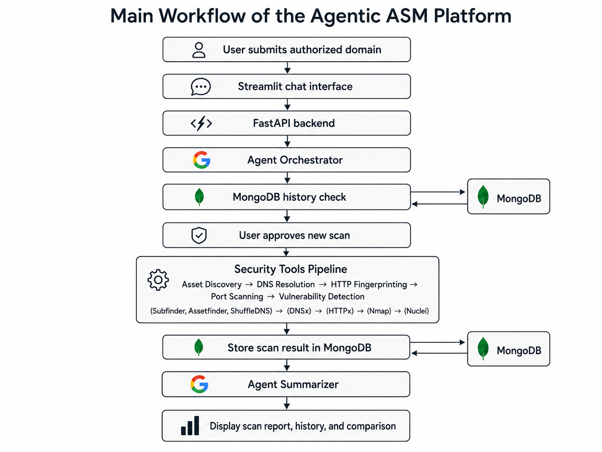

# 🛡️ Agentic AI for Attack Surface Management

An agentic AI platform for authorized attack surface discovery, service fingerprinting, vulnerability detection, and AI-assisted reporting.

The user submits a domain through a Streamlit chat interface. A FastAPI backend checks MongoDB for previous scan data, requests confirmation before scanning, runs the security workflow, stores the results, and generates a concise AI summary.

## 🔄 Architecture



The project uses:

- **Streamlit** for the chat interface
- **FastAPI** for the backend
- **LangChain and Gemini** for agent coordination and reporting
- **MongoDB** for scan storage
- **Docker Compose** for local database services

The scanning workflow includes:

- `subfinder` and `assetfinder` for passive subdomain discovery
- `shuffledns` for brute-force subdomain discovery
- `dnsx` for DNS resolution
- `httpx` for HTTP service discovery and technology fingerprinting
- `nmap` for port scanning
- `nuclei` for vulnerability detection

## 🤖 How It Works

1. The user enters a domain.
2. The agent checks MongoDB for an existing record.
3. The agent asks for confirmation before starting a new scan.
4. The platform performs asset discovery, enumeration, fingerprinting, and vulnerability detection.
5. Results are stored in MongoDB and summarized by the AI.

## 📋 Requirements

This project is designed to run in a Linux environment or WSL on Windows.

Install the basic dependencies:

```bash
sudo apt update
sudo apt install -y python3 python3-venv git golang-go nmap curl
```

Add the Go binary directory to your PATH:

```bash
echo 'export PATH=$PATH:$HOME/go/bin' >> ~/.bashrc
source ~/.bashrc
```

Install the security tools:

```bash
go install -v github.com/projectdiscovery/subfinder/v2/cmd/subfinder@latest
go install -v github.com/projectdiscovery/httpx/cmd/httpx@latest
go install -v github.com/projectdiscovery/dnsx/cmd/dnsx@latest
go install -v github.com/projectdiscovery/shuffledns/cmd/shuffledns@latest
go install -v github.com/projectdiscovery/nuclei/v3/cmd/nuclei@latest
go install github.com/tomnomnom/assetfinder@latest
```

Update the Nuclei templates:

```bash
nuclei -update-templates
```

## 📂 Wordlist and DNS Resolvers

`shuffledns` requires a subdomain wordlist and a DNS resolver list.

Create the required directory:

```bash
mkdir -p data/wordlists
```

Download the Assetnote two-million-subdomain wordlist:

```bash
curl -L https://wordlists-cdn.assetnote.io/data/manual/2m-subdomains.txt \
  -o data/wordlists/2m-subdomains.txt
```

Download the Trickest resolver list:

```bash
curl -L https://raw.githubusercontent.com/trickest/resolvers/main/resolvers.txt \
  -o data/wordlists/resolvers.txt
```

The expected structure is:

```text
data/
└── wordlists/
    ├── 2m-subdomains.txt
    └── resolvers.txt
```

## ⚙️ Installation

Clone the repository:

```bash
git clone https://github.com/YOUR_USERNAME/agentic-asm-platform.git
cd agentic-asm-platform
```

### 🔑 Environment Variables

Create `backend/.env`:

```env
MONGO_URI=mongodb://localhost:27017
DB_NAME=asm_agent
GEMINI_API_KEY=your_gemini_api_key
```

Do not commit this file to GitHub.

### 🗄️ Start MongoDB

From the project root:

```bash
docker compose up -d
```

Mongo Express will be available at:

```text
http://localhost:8081
```

### 🚀 Start the Backend

```bash
cd backend
python3 -m venv .venv
source .venv/bin/activate
pip install -r requirements.txt
uvicorn app.main:app --reload --port 8000
```

The API will be available at:

```text
http://localhost:8000
```

### 💬 Start the Frontend

Open another terminal:

```bash
cd frontend
python3 -m venv .venv
source .venv/bin/activate
pip install -r requirements.txt
streamlit run streamlit_app.py
```

## 🧪 Example Usage

In the Streamlit app, the user can ask:

```text
Scan domain younesali.com
```

The agent checks MongoDB for an existing record and asks for confirmation before starting a new scan.

The user can then reply:

```text
yes
```

After completing multiple scans, the user can retrieve the saved scan history:

```text
What is the database history of younesali.com?
```

The user can also compare two previous scans:

```text
compare scan 10 and scan 5
```

During development, I tested the project against my own personal website, [younesali.com](https://younesali.com).

## ⚠️ Responsible Use

Use this project only against:

- Domains and systems you own
- Systems for which you have explicit authorization
- Local or intentionally vulnerable security labs

Do not scan third-party systems without permission.
